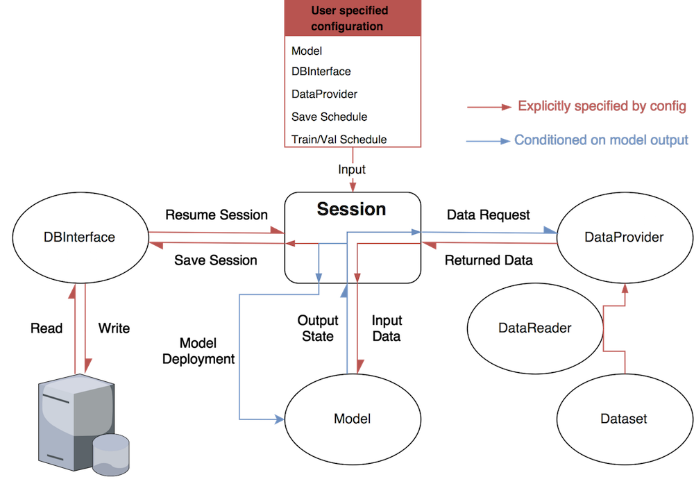

# PTUtils
PyTorch utilities for neural network research.

**Current status: pre-alpha. The API is still TDB and likely to change.**

## Overview
PTUtils is a utility package built for coordinating neural network experiments
PTUtils is a PyTorch utility package designed for coordinating neural network experiments with dynamics and modularity in mind. Inspired by its Tensorflow sibling, [tfutils](https://github.com/neuroailab/tfutils), PTUtils provides functionality for constructing, runing and monitoring dynamic neural network models, retrieving data from multiple data sources 'on the fly', and interfacing with common databases.

### Creating dynamic experiments
The 'define-by-run' paradigm established by deep learning frameworks such as Chainer, DyNet, PyTorch offers a powerful new way to structure neural network computations: the execution of the model/graph is conditioned on the state of the model itself, forming a *dynamic graph*. PTUtils attempts to *leverage and extend PyTorch's dynamic nature* by giving researchers a fully *dynamic experiment* whereby execution of the entire experiment is conditioned on the state of the experiment and any component contained within. The long-term motivation behind this approach is to provide researchers with a dynamic environment in which they can control the behavior/interactions of/between a model/collection of models as well as the data that is presented to the models, while saving the evolution of the environment behind the scenes. 

### Lessons learned
A number of important requirement emerged out of tfutils' redesign:

* **Simplicity:** streamline API and reduce relience on specific conventions to specify and run an experiment by enforcing an extremely concise set of rules on a single base class 
* **Modularity:** increase fine-grain control by generating a library of small, independent and **compatible** units of functionality from the same base class
* **Customizability:** provide more opportunities for custom behavior by allowing users to override the default functionality of any given unit without disrupting the others
* **Flexibility:** expand set of possible usage patterns by specifying experiments in terms of the composition of customized functional units.

**Example use case:** Suppose you would like to study the interactions between two agents deployed in a common, simulated environment. Presumably, the behavior of each agent is determined by a separate model, and the data presented to each model is conditioned on the global environmental state. 

## Proposed Control Flow

The figure below depicts the intended high-level control flow of PTutils. Each module will operate independently as a standalone unit. You will be free to use any combination of modules that best suites your needs without worrying about inter-module dependencies. For example, you may choose to only use the DBInterface class for saving results to a database and handle the rest of the experiment yourself. Alternatively, you may choose to subclass `Config` and let PTUtils handle the rest. It's up to you!



The details are explained below.

## Design principles

At the core of PTUtils is the `Module`class, the base class for all ptutils objects that shamelessly attempts to generalize PyTorch's existing `torch.nn.Module`. A `Module` is an arbitrary, container-like object that fulfills three simple requirements:

1. All `Module` subclasses must either be **callable** or contain a callable attribute. In other words, all modules must perform an action.

2. All `Module` subclasses must implement a `state_dict()` (potential alias: `state()`) method that returns an object (likely a dict) that reflects the *state* of the module at the time `state_dict()` was called. What constitues a module's '*state*' can be completely specified by the user, although PTUtils offers concrete and sensible options.

3. All `Module` subclasses must implement a `load_state_dict()` (potential alias: `load_state()`) method that accepts the object returned by that module's `state_dict()` method and restores that module to the state it was in when `state_dict()` was called.


Enforcing this simple API attempts to address the notion that the environment in which a neural network operates should be free to evolve dynamically just as the network itself is. 

Although users are free to subclass the `Module` class in any way they please, ptutils provides a set of core modules with which users can conveniently carry out neural network experiments. The core putils modules (and their corresponding callables) include:

* `Module.call()`: Base class for all modules that raises a NotImplemented exception when called.
* `Session.run()`: Carry out a neural network experiement.
* `Status.check()`: Verify the status of a Module.
* `Model.forward()`: Execute the forward pass of a neural network model.
* `DataReader.read()`: Load data of a particular format.
* `DBInterface.access()`: Interact (read, write and query) with a database. 
* `DataLoader.__iter__()`: Iterate over data objects in a dataset.
* `Dataset.__getitem__()`: Return a single data object (image, label pair) from a dataset.
* `DataProvider.provide()`: Manage all datasets and generate specified `DataLoader`s.
* `Configuration.configure()`: Generate more complicated modules or groups of modules.

PTUtils will have one very special module: the `State` module. An instance `s` of the `State` class preserves the following:

```python
    s = s(*args, **kwargs) = s.state_dict(*args, **kwargs) = s.load_state_dict(*args, **kwargs).
```

Calling a state object or its two state_dict with any arguments will always return the original state object unmodified. Under the hood, the `State` class is an enhanced python dictionary with support for 'dot' notation and instrospective features such as recognizing any modules it contains.

With the exception of the `Module` base class, all PTUtils modules will come pre-fitted with default behavior that is '*compatible*' with the operation of the other modules. In other words, one can carry out a standard neural network experiment without writing any lines of code, provided that the modules are configured properly, of course. On the other hand, users can (and are encouraged) override any and/or all of the core module methods (within the boundaries of the API) and expect the other modules to remain functional. This flexibility is particularly useful for writing custom training loops while maintaining the same logging/saving behavior.
 optionally exhibits user-defined behavior. All that core components that make up a neural network experiment will subclass the :class:`Module` class. 

As a flexible container class, Modules can register and call other Modules as regular attributes, allowing users to nest them in a tree structure. The advantage here is that generating the state of a parent module is as simply as collecting the states of its children. Eventually, the states of modules without children will propogate back to the root module.
